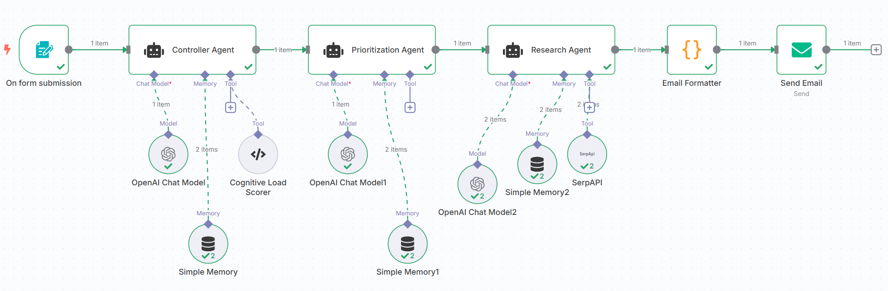

# ARIA — Adaptive Routine Intelligence Assistant

**ARIA** is an AI-powered personal productivity system built with **n8n** that intelligently analyzes, prioritizes, and researches your daily tasks — then delivers a beautifully formatted briefing straight to your inbox.

> Built using multi-agent orchestration, custom tooling, and real-time web search.

---

## Workflow Overview



---

## What ARIA Does

You fill out a simple form with your tasks for the day. ARIA then runs a fully automated multi-agent pipeline:

| Step | Agent | What Happens |
|------|-------|-------------|
| 1 | **Controller Agent** | Analyzes each task, breaks it into actionable items, identifies urgency and importance |
| 2 | **Cognitive Load Scorer** | Custom tool that scores how mentally draining each task is (1–10 scale) |
| 3 | **Prioritization Agent** | Categorizes tasks using the Eisenhower Matrix |
| 4 | **Research Agent** | Searches the web for tips and resources for high-priority tasks |
| 5 | **Email Formatter** | Converts everything into a clean, styled HTML email |
| 6 | **Send Email** | Delivers your personalized daily briefing to your inbox |

---

## System Architecture

```
┌─────────────────────────────────────────────────────────────┐
│                      ARIA Pipeline                          │
│                                                             │
│  [Form Submission]                                          │
│         ↓                                                   │
│  [Controller Agent] ←→ [Cognitive Load Scorer Custom]       │
│         ↓                                                   │
│  [Prioritization Agent] (Eisenhower Matrix)                 │
│         ↓                                                   │
│  [Research Agent] ←→ [SerpApi Web Search]                   │
│         ↓                                                   │
│  [Email Formatter]                                          │
│         ↓                                                   │
│  [Send Email → Your Inbox]                                  │
└─────────────────────────────────────────────────────────────┘
```

---

## Tech Stack

| Tool | Role |
|------|------|
| [n8n](https://n8n.io) | Workflow orchestration platform |
| [OpenAI GPT-4o](https://openai.com) | AI reasoning engine for all agents |
| [SerpApi](https://serpapi.com) | Real-time Google web search |
| [Gmail SMTP](https://gmail.com) | Email delivery |
| JavaScript | Custom Cognitive Load Scorer tool |
| Node.js v20+ | Runs n8n locally |

---

## Agent Descriptions

### Controller Agent
The orchestrator of the entire system. It receives the raw task list from the form, breaks each task into clear actionable items, identifies which tasks need research, assesses urgency and importance, and passes a structured analysis downstream to the next agent.

**Memory:** Simple Memory with email-based session ID, allowing it to recognize returning users.

---

### Prioritization Agent
Applies the **Eisenhower Matrix** framework to sort tasks into four quadrants, then generates a recommended execution order with time estimates for the day.

| Quadrant | Criteria | Action |
|----------|----------|--------|
| 🔴 DO FIRST | Urgent + Important | Tackle immediately |
| 🟡 SCHEDULE | Not Urgent + Important | Block time for later |
| 🔵 DELEGATE | Urgent + Not Important | Hand off if possible |
| ⚪ ELIMINATE | Not Urgent + Not Important | Drop or defer |

---

### Research Agent
Takes the highest-priority tasks and searches the web in real time using **SerpApi**. Finds practical tips, techniques, and resources specific to each task — going beyond GPT-4o's training data to surface current, relevant information.

---

## Custom Tool: Cognitive Load Scorer

**File:** [`custom-tools/cognitive-load-scorer.js`](custom-tools/cognitive-load-scorer.js)

A custom JavaScript tool that scores each task on a **1–10 cognitive load scale** based on keyword analysis.

### How It Works

```
Input: "study for exam, email professor, finish assignment"
         ↓
Split into individual tasks
         ↓
Score each task:
  Base score: 3
  + High-load keywords (study, write, analyze, finish): +2 each
  + Medium-load keywords (review, prepare, call): +1 each
  + Urgency keywords (deadline, urgent, due): +1 each
  Cap at 10
         ↓
Output:
  study for exam:      7/10 🟡 Medium cognitive load
  email professor:     3/10 🟢 Low cognitive load
  finish assignment:   8/10 🔴 High cognitive load

  Overall Daily Load: MODERATE — Balance your day evenly
```

### Why This Matters

Most productivity tools schedule by urgency alone. ARIA goes further — it schedules by **mental energy**, placing the most cognitively demanding tasks during peak focus hours and lighter tasks when energy dips. This is the core innovation that separates ARIA from a basic task manager.

### Tool Specification

| Property | Detail |
|----------|--------|
| **Input** | Comma-separated string of tasks |
| **Output** | Cognitive load report (string) |
| **Language** | JavaScript |
| **Integrated With** | Controller Agent (n8n Code Tool node) |
| **Limitations** | Keyword-based scoring — does not understand full sentence context |

---

## Sample Email Output

```
🤖 Good morning, Mridula!

Here is your personalized ARIA daily briefing.

📊 Task Analysis
──────────────────────────────────────────
1. Finish Report
   - Actionable Items: Review structure, gather data, write and edit...
   - Urgency: High | Importance: High

2. Study for Test
   - Actionable Items: Organize notes, practice past questions...
   - Urgency: High | Importance: High

🔴 Prioritized Tasks
──────────────────────────────────────────
1. Finish Report        → DO FIRST  (2-3 hours)
2. Study for Test       → DO FIRST  (2 hours)
3. Meet with Mary       → SCHEDULE  (1 hour)
4. Write Notes Ch. 3    → SCHEDULE  (1 hour)
5. LeetCode Practice    → ELIMINATE (defer)

🔍 Research Findings
──────────────────────────────────────────
Finish Report:
  - Use clear topic sentences to guide readers through each section
  - Structure with distinct headings for logical flow

Study for Test:
  - Active recall outperforms re-reading for retention
  - Spaced repetition maximizes long-term memory

Have a productive day! 🚀
Sent by ARIA — Your Adaptive Routine Intelligence Assistant
```

---

## Setup & Installation

### Prerequisites

- Node.js v18 or higher
- OpenAI account with API key ($5 credits recommended)
- SerpApi account (free tier: 100 searches/month)
- Gmail account with 2-Step Verification enabled

### Step 1 — Clone the Repository

```bash
git clone https://github.com/yourusername/aria-productivity-agent.git
cd aria-productivity-agent
```

### Step 2 — Install n8n

```bash
npm install -g n8n
```

### Step 3 — Start n8n

```bash
n8n start
```

Then open [http://localhost:5678](http://localhost:5678) in your browser.

### Step 4 — Import the Workflow

1. Go to **Workflows** in the n8n sidebar
2. Click **Import**
3. Select `workflow/aria-workflow.json`

### Step 5 — Configure Credentials

Inside n8n, add the following credentials:

| Credential | Where to Get It |
|-----------|----------------|
| OpenAI API Key | [platform.openai.com/api-keys](https://platform.openai.com/api-keys) |
| SerpApi API Key | [serpapi.com/dashboard](https://serpapi.com/dashboard) |
| Gmail SMTP | Google Account → Security → App Passwords |

### Step 6 — Run ARIA

1. Open the workflow in n8n
2. Click **Execute workflow**
3. Open the **Test URL** in a new tab
4. Fill in your tasks and submit
5. Check your inbox! 